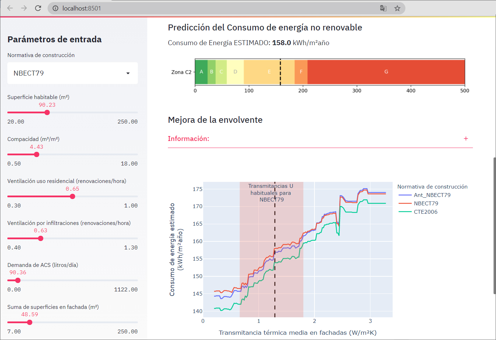

#  ML_energia_app

Esta aplicación predice el consumo de energía (kWh/m²) a partir de miles de datos de certificados energéticos elaborados con el programa CE3X.

En el **[siguiente enlace](https://share.streamlit.io/raultomasmora/ml_energia_app/main/ML_energy_app.py)** se puede ver la implementación web del proyecto en [Streamlit](https://streamlit.io/).

## Sobre el proyecto
El proyecto ha sido elaborado por el investigador [Raúl Mora-García](https://publons.com/researcher/1717710/raul-tomas-mora-garcia/publications/) rtmg@ua.es en colaboración con [Grupo Valero](https://www.grupovalero.com/) durante el año 2020. Subvención AEST/2019/005 del Programa para la promoción de la investigación científica, el desarrollo tecnológico y la innovación en la Comunitat Valenciana (Anexo VII) [DOGV nº8355](http://www.dogv.gva.es/datos/2018/08/06/pdf/2018_7758.pdf).

## Descripción del proyecto
Esta aplicación predice el consumo de energía (kWh/m²año) a partir de miles de datos de certificados energéticos elaborados con el programa [CE3X](https://www.efinova.es/CE3X). Después se evalúa la posible reducción del consumo de energía al mejorar el aislamiento de la envolvente.

**Modelo:** Esta herramienta se desarrolla mediante aprendizaje automático supervisado (*supervised machine learning*) con algoritmos de regresión. Se ha diseñado un modelo de conjunto (*enseble learning*) que combina tres algoritmos de aprendizaje distintos basados en boosting: CatBoost Regressor [*catboost*](https://catboost.ai/), Light Gradient Boosting Machine [*lightgbm*](https://lightgbm.readthedocs.io/) y Gradient Boosting Regressor [*gbr*](https://scikit-learn.org/stable/auto_examples/ensemble/plot_gradient_boosting_regression.html).

**Datos:** Se utilizan más de 10.000 datos de certificados energéticos de viviendas individuales de la provincia de Barcelona (ubicados en zona climática C2), procedentes del [Instituto Catalán de Energía](http://icaen.gencat.cat/es/inici/).

**Precisión:** El modelo de conjunto se ha probado en un conjunto de datos de entrenamiento obteniéndose un R2 de 0.888, y en el conjunto de prueba un R2 de 0.732. Para datos nuevos no utilizados en el modelo se ha obtenido un R2 de 0.790, lo que indica que el modelo generaliza correctamente.

## Parámetros necesarios en el modelo
Descripción de los parámetros utilizados en el modelo:
- Normativa de construcción. *Se definen tres periodos normativos según el año de construcción: Anterior a la norma NBE-CT79, conforme a la norma NBE-CT79 o conforme a la norma CTE2016.*
- Superficie habitable (m²). *Superficie útil de la vivienda (en m²).*
- Compacidad (m³/m²). *Compacidad calculada conforme al CTE (volumen/área de la envolvente).*
- Ventilación uso residencial (renovaciones/hora). *Renovaciones hora de aire exterior para uso residencial establecido en el CTE (en renovaciones/hora).*
- Ventilación por infiltraciones (renovaciones/hora). *Renovaciones hora de aire exterior debido a infiltraciones por la carpintería (en renovaciones/hora).*
- Demanda de ACS (litros/día). *Demanda de agua caliente sanitaria conforme al CTE (en litros/día).*
- Suma de superficies en fachada (m²). *Total de las superficies de fachada en contacto con el exterior y que forman parte de la envolvente térmica (en m²).*
- Transmitancia térmica media en fachadas (W/m²K). *Valor medio de la transmitancia térmica de los cerramientos que forman parte de la envolvente térmica (en W/m²K).*
- Suma de superficies en cubierta (m²). *Total de las superficies de cubierta en contacto con el exterior y que forman parte de la envolvente térmica (en m²).*
- Transmitancia térmica media en cubiertas (W/m²K). *Valor medio de la transmitancia térmica de las superficies de cubierta que forman parte de la envolvente térmica (en W/m²K).*
- Suma de superficies en huecos (m²). *Total de las superficies de los huecos en contacto con el exterior y que forman parte de la envolvente térmica (en m²).*
- Transmitancia térmica media en huecos (W/m²K). *Valor medio de la transmitancia térmica de las superficies de los huecos que forman parte de la envolvente térmica (en W/m²K).*
- Factor solar promedio en huecos (g). *Valor medio del factor solar de las superficies acristaladas que forman parte de la envolvente térmica (g es un valor adimensional entre 0 y 1).*
- Suma de longitudes con puentes térmicos (metros). *Total de las longitudes de los puentes térmicos en contacto con el exterior y que forman parte de la envolvente térmica (en metros).*
- Transmitancia térmica media lineal en puentes térmicos (W/mK). *Valor medio de la transmitancia térmica de los puentes térmicos que forman parte de la envolvente térmica (en W/mK).*
- Tipo de instalación para calefacción. *Se definen 6 posibles casos de instalaciones de calefacción: Sin definir, Efecto Joule, Caldera Estándar, Bomba de calor, Caldera de condensación, y Otros sistemas.*
- Tipo de instalación para refrigeración. *Se definen 4 posibles casos de instalaciones de calefacción: Sin definir, Maquina frigorífica, Bomba de calor, y Otros sistemas.*
- Reducc_EPNoR (kWh/m²∙año). *Producción de energía renovable (en kWh/m²∙año).*

## Screenshots

